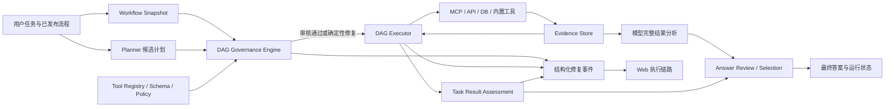

# LangChain4j ChatChat

LangChain4j ChatChat 是一个基于 Spring Boot、LangChain4j、Vue 3 与 MCP 的企业级 AI Chat、RAG 和 Agent Runtime。项目的核心不是让模型决定流程是否正确，而是让 Runtime 按用户发布的流程定义审核、修复并持续执行 DAG；模型负责理解任务和分析完整工具结果，Runtime 负责流程、契约、证据与交付治理，不生成业务判断。

> 核心目标：**RUN**。单个节点失败、模型计划漂移或某次工具调用异常，不应直接终止整个任务；只要仍存在可执行路径或可用证据，Runtime 就应恢复流程、继续执行并如实交付结果。

## 当前设计基线

### 与旧设计的差异

| 维度 | 旧设计风险 | 当前设计 |
| --- | --- | --- |
| 流程标准 | 把 Planner 生成的计划当成事实标准 | 用户发布的工作流快照是唯一业务流程标准；Planner 只提交候选计划 |
| DAG 审核 | 校验失败后反复要求模型重写，最终可能终止 | Runtime 将候选计划与标准 DAG 对账，确定性恢复节点、边、顺序和失败策略 |
| 模型漂移 | 不同模型输出结构不同，导致节点缺失、改名或越序 | 依据工作流快照、工具注册表和 Schema 修复，不依赖模型自我纠错 |
| 节点失败 | 任一工具失败即可把 Agent task 标记为失败 | 节点失败与任务失败分离；独立分支继续，最终聚合为成功、部分成功或失败 |
| 模板执行 | 发现模板后可能只执行一个，或中途停止 | 已准入模板必须逐个到达终态；批量执行不因单项失败停止 |
| 参数缺失 | 让模型重新猜测参数，或针对工具写特例 | 从用户输入、Agent 上下文和已验证的上游证据按 Tool Schema 恢复参数 |
| 环境信息 | 截断摘要缺字段被误判为真实缺失 | Agent 已配置环境和结构化上下文优先；摘要截断不等于字段不存在 |
| 最终结论 | Runtime 用固定文案修正模型业务结论 | Runtime 提供完整证据，由模型进行二次分析；Runtime 只选择合规候选答案 |
| MCP 名称 | 依赖前缀裁剪或模糊匹配识别工具 | 规范名、发布名、传输限定名显式映射，审核统一使用规范名 |
| 可观测性 | 页面只看到“失败”，看不到恢复过程 | 修复以结构化事件展示检测、修复、校验和继续执行的完整链路 |

### 不可变原则

1. **用户流程是唯一业务标准。** Runtime 不得用模型偏好、通用最佳实践或工具返回内容改写用户定义的业务目标与流程语义。
2. **Planner 输出只是候选。** 模型可以提出节点和参数，但无权删除强制节点、改变依赖关系或提前结束已发布流程。
3. **自动修复不依赖模型。** 拓扑、名称、Schema、参数来源、失败传播与重试修复必须由确定性契约完成。
4. **禁止场景硬编码。** 不得按具体表、字段、客户、模型、供应商、工具或业务关键词生成修复分支及业务结论。
5. **完整执行优先。** 已准入节点必须执行到明确终态；一个工具失败不等于整个任务失败。
6. **模型负责分析。** 工具原始结果和完整执行证据交给模型分析；Runtime 不输出“符合/不符合”等业务判断。
7. **事实可追溯。** 最终答案中的关键事实必须能映射到用户输入、工具证据或明确标注的模型推断。

权限、工具 Schema、平台安全策略和执行预算构成用户流程的系统边界；它们不是第二套业务判断标准。

## Runtime 架构



Runtime 的权威输入按优先级为：

1. 用户请求与已发布的工作流快照；
2. 工具注册表、Tool Schema、权限和安全策略；
3. Agent 结构化上下文与已验证的上游证据；
4. Planner 产生的候选 DAG 和参数建议；
5. 用于展示的摘要文本。

低优先级信息不得覆盖高优先级事实。特别是 `summaryTruncated=true` 只说明展示摘要不完整，不能据此判定完整结果缺少字段。

## DAG 审核与自动修复

### 标准处理链

```text
用户流程快照
  -> Planner 候选 DAG
  -> 规范工具名解析
  -> 节点与边对账
  -> Schema 与参数来源校验
  -> 确定性修复
  -> 修复后重新校验
  -> 分波次执行
  -> 失败隔离与证据增广
  -> Evidence Normalizer / Compression Gate（仅供 DAG rewrite）
  -> 任务级结果聚合
  -> 模型基于完整证据分析
  -> 答案评审与交付
```

### 通用漂移类型

Runtime 按结构事实识别漂移，而不是按自然语言猜测：

- 强制节点缺失、重复或出现未声明节点；
- 依赖边缺失、反向、越序或形成环；
- 工具使用发布名、传输限定名或模型别名，未绑定规范名；
- 输入字段位于错误层级、类型不符或来源不可追溯；
- Agent 上下文已有环境信息，但候选计划错误标记为缺失；
- 已选择模板未全部进入执行终态；
- 单节点失败被错误传播为任务级失败；
- 模型提前给出最终答案，跳过工作流强制工具。

### 修复边界

允许 Runtime 自动执行的修复包括：

- 从工作流快照恢复缺失节点、依赖边、执行顺序和失败策略；
- 通过注册表的显式映射把发布工具名绑定到 `canonicalToolName`；
- 按 Tool Schema 提升或展开通用参数封装；
- 从用户输入、Agent 上下文和已完成节点证据中恢复可验证参数；
- 隔离失败分支并调度仍满足依赖的节点；
- 对可重试错误执行有预算、可审计且满足幂等约束的重试；
- 在证据不足时继续执行工作流允许的检索或增广节点。

Runtime 不得：

- 猜测无法从权威上下文验证的业务参数；
- 为某张表、某个字段或某个工具写专用修复逻辑；
- 因模型建议而删除用户流程中的强制步骤；
- 用固定业务文案替换模型分析结果；
- 把摘要中的字段缺失当作完整结果缺失；
- 用字符串裁剪或模糊匹配推导 MCP 规范工具名。

## 执行、失败与任务状态

### 节点终态

每个已准入节点都必须到达可解释终态，例如：

- `SUCCEEDED`：调用成功并产出有效证据；
- `FAILED`：调用真实失败，已记录错误和尝试次数；
- `BLOCKED`：依赖、权限或安全条件不满足；
- `SKIPPED`：仅在用户流程明确定义的条件分支中不适用。

已筛选出的模板必须全部执行到终态。批量模板执行采用失败隔离语义，单个模板失败不能阻止其余模板执行。

### 任务级结果

任务状态由执行事实聚合，而不是从某条日志或某个节点直接复制：

- `SUCCESS`：用户流程要求已满足；
- `PARTIAL_SUCCESS` / `PARTIAL`：存在可交付证据，但部分目标未满足或部分节点失败；
- `FAILED`：没有可交付结果，且所有允许的恢复路径均已穷尽；
- `CANCELLED`：收到明确取消信号。

最终答案必须说明已完成内容、失败或缺失内容、证据边界及必要的后续动作。工具失败可以被明确披露，但不得在仍有可用结果时把整项任务错误标为失败。

## 证据与模型二次分析

Runtime 保留完整工具输出、结构化证据对象、来源节点和尝试信息。展示摘要可以截断，但规划、参数恢复、最终综合和答案复核使用完整证据快照。

`InterpretationPlanRewriter` 例外地只读取 `evidence_compression_gate_v1` 生成的有界调度视图。网关确定性保留证据标识、节点/工具状态、错误、缺口、冲突、假设、下一动作和结构化样本，并对重复 observation 去重；完整证据仍留在 Runtime Evidence Store，供最终综合、复核、审计和重放使用。

最终分析采用 `model_analysis_repair_v1` 协议：

1. 首次综合模型读取本次执行的完整证据；
2. Answer Reviewer 使用同一证据快照审核重要事实、遗漏和矛盾；
3. 如果初稿错误，Reviewer 模型返回完整修订答案；
4. Answer Decision Engine 仅在显式修订状态下选择该模型答案；
5. 临时审阅上下文在本次运行后清理，避免跨请求污染。

这条链路修复的是“分析过程”，不是由 Runtime 预设“正确结论”。因此它对表设计审核、金融数据分析、通用 API 查询等场景使用同一套机制，也能适配不同模型的表达和推理差异。

## `web_search` 本地优先策略

`web_search` 的来源优先级由搜索处理层保证，不依赖模型规划，也不在 Agent Runtime 中硬编码金融业务规则。一次统一检索按以下顺序执行：

1. 本地新闻索引；
2. 本地受治理的金融资产索引，以及从动态匹配数据集中读取的已采集金融数据；
3. 联网搜索缓存或外部联网 API，仅用于补充本地证据缺口。

前两项同属本地主来源，执行时金融资产与数据检索先完成，以便其证据量参与是否需要联网的判定；这不表示金融数据高于本地新闻。金融数据集完全通过资产索引动态匹配，不依赖模型传入 `financial_data_required`，也不硬编码业务关键词或数据集名称。

本地金融数据记录与本地新闻命中的合计证据量达到 `chatchat.runtime.news.web-search.minimum-local-results`（默认 `3`）时，不调用付费联网 API。`force-external` 仅作为显式运维覆盖开关，并通过 `retrievalOrder`、`externalSearchRole`、`localEvidenceSufficient` 和 `externalSearchRequired` 返回实际路由信息，便于审计。

## MCP 发布命名规范

MCP 发布名称必须与 API 流程审核使用的规范工具名一致。

规范名格式：

```text
{domain}_{capability}_{action}
```

要求：

- 只使用小写 ASCII 字母、数字和下划线；
- 不包含租户、环境、主机、模型、时间戳或部署实例；
- API 注册表、DAG 节点、权限 Scope、审计记录和 MCP Tool Schema 使用同一个 `canonicalToolName`；
- 工具重命名必须提供显式别名、迁移期和兼容测试。

示例映射：

```json
{
  "canonicalToolName": "api_template_execute",
  "publishedToolName": "api_template_execute",
  "transportQualifiedName": "mcp_chatchat_mcp_server_api_template_execute",
  "capability": "template_execute",
  "assetType": "api_service"
}
```

DAG 审核、权限判断和结果聚合只使用 `canonicalToolName`；调用适配器仅在最后一跳使用 `transportQualifiedName`。

## 可观测性

DAG 修复不是隐藏的内部动作。后端必须发布结构化事件，前端按字段渲染状态，不匹配中英文日志文本：

```json
{
  "eventKind": "DAG_REPAIR",
  "eventState": "STARTED | APPLIED | REJECTED",
  "repairAttempt": 1,
  "fromIteration": 1,
  "toIteration": 2,
  "reason": "结构化触发原因",
  "failedStepId": 1,
  "failedToolName": "canonical_tool_name",
  "changeCount": 2,
  "changes": [],
  "validationIssues": []
}
```

页面应展示“检测到问题 → 修复中 → 已修复/修复未通过 → 继续执行”的完整链路。修复事件可以显示告警，但不能直接把整个 Run 标记为失败。

审计记录至少应能回答：用户流程是什么、模型发生了什么漂移、Runtime 修复了什么、每个节点的终态是什么，以及任务为何得到当前聚合状态。

图表和工具结果展示应保留原始数值；例如 Tooltip 显示 `2700`，不把元数据格式化为 `2.7k` 后冒充原始数据。

## 核心能力

- 对话服务：普通与流式 LLM 对话、会话管理和消息持久化；
- RAG：文档上传、抽取、分块、关键词/向量检索与知识库问答；
- Agent Runtime：候选计划、DAG 审核、自动修复、分波执行、证据增广和答案评审；
- MCP：服务管理、工具发现、规范命名、调用路由和独立 MCP Server；
- 工具体系：API 模板、数据库查询、文档检索、文件系统、Web 与内置工具；
- 企业治理：租户、组织、角色、权限、数据源、工具权限和审计；
- 前后端一体化：Vue 3 + Vite 构建产物随 Spring Boot 应用发布；
- 生产发布：主应用、MCP Server 和专用 Runtime 模块可独立构建部署。

## 项目结构

| 模块 | 职责 |
| --- | --- |
| `chatchat-common` | 公共配置、DTO、工具元数据、响应模型和基础常量 |
| `chatchat-license` | License 能力与授权支持 |
| `chatchat-agents` | Agent 编排、DAG Runtime、执行恢复、证据与答案治理 |
| `chatchat-tools` | Web、数据库、文档、文件系统等内置工具 |
| `chatchat-runtime-mcp` | 内置 MCP 能力的统一注册、配置和调用路由 |
| `chatchat-runtime-news` | 新闻采集、规范化、去重、索引和 Agent 检索 Runtime |
| `chatchat-runtime-market` | MCP Server 内部市场数据能力库 |
| `chatchat-knowledge-base` | 文档加载、抽取、分块、检索、RAG 与 RocksDB 存储 |
| `chatchat-chat` | 会话、统一交互、技能目录和异步 Agent 任务 |
| `chatchat-enterprise` | 租户、组织、角色、权限、用户、数据源和审计 |
| `chatchat-api` | 主应用入口、REST/WebSocket、Web UI 和发行包 |
| `chatchat-mcp-server` | 独立 MCP Server、API/数据库工具发布、缓存和调用审计 |
| `chatchat-integration` | 模型供应商、MCP 和外部服务集成 |
| `chatchat-e2e-tests` | 跨模块生产级回归与发布门禁 |

## 服务拓扑

```text
Browser / Vue Web App
        |
        v
chatchat-api :8080
  - Chat / RAG / Agent Runtime / Enterprise / MCP Proxy
        |
        +--> ChatModel / EmbeddingModel
        +--> H2 / MySQL / PostgreSQL / RocksDB
        +--> chatchat-mcp-server :8090
                - MCP endpoint /mcp
                - Admin UI /admin
                - API / DB / LiveData / Market capabilities
                +--> chatchat-runtime-news :8091
```

默认入口：

| 服务 | 地址 |
| --- | --- |
| Web / Chat API | `http://localhost:8080` |
| OpenAPI JSON | `http://localhost:8080/api-docs` |
| MCP Admin | `http://localhost:8090/admin` |
| MCP Endpoint | `http://localhost:8090/mcp` |
| News Runtime | `http://localhost:8091`，仅供内部通信 |

## 快速开始

### 环境要求

- JDK 17+
- Maven 3.8+
- Node.js 与 npm

### 一键启动本地完整链路

Windows PowerShell：

```powershell
.\run-chat-api-mcp.ps1
```

或：

```cmd
run-chat-api-mcp.bat
```

脚本会构建并依次启动 MCP Server、News Runtime 和 Chat API。Market 能力作为 MCP Server 内部依赖构建和打包。

```powershell
.\run-chat-api-mcp.ps1 -Action status
.\run-chat-api-mcp.ps1 -Action stop
.\run-chat-api-mcp.ps1 -Action restart -SkipBuild
.\run-chat-api-mcp.ps1 -Clean
.\run-chat-api-mcp.ps1 -WithTests
```

本地日志位于 `logs/local-dev/`，PID 位于 `run/local-dev/`。

### Maven 构建与运行

```bash
# 构建全部模块
mvn clean package -DskipTests

# 运行主应用
mvn -pl chatchat-api -am spring-boot:run

# 运行 MCP Server
mvn -pl chatchat-mcp-server -am spring-boot:run
```

构建 `chatchat-api` 时会在 `chatchat-api/web-app` 执行前端安装和构建，并将产物打入 Spring Boot jar。

## 配置

主应用生产配置：

```text
packaging/config/application.yml
packaging/config/application-mysql.yml
```

MCP Server 配置：

```text
chatchat-mcp-server/src/main/resources/application.yml
chatchat-mcp-server/src/main/distribution/config/application.yml
```

推荐为每个模型配置独立连接：

```yaml
chatchat:
  models:
    defaultChatModel: qwen-plus
    chatModels:
      qwen-plus:
        apiKey: ${DASHSCOPE_API_KEY:}
        baseUrl: https://dashscope.aliyuncs.com/compatible-mode/v1
        protocol: auto
        timeout: 180000
        maxTokens: -1
        maxRetries: 3
```

`protocol` 支持 `auto`、`openai`、`dashscope-native`、`dashscope-multimodal` 和 `dashscope-text`。模型名包含 `.` 时，推荐使用带引号的 Spring Map 键，例如 `"[qwen3.8-max]"`。API Key 应由环境变量或密钥服务注入，不得提交到仓库。

内部服务口令从各自 YAML 的 `encrypted-secret: ENC(...)` 加载，并通过 `config/internal-credential.key` 解密。生产部署应同步替换各服务密文与密钥文件，并限制密钥读取权限。

## 生产打包

```bash
# 主应用发行包
mvn -pl chatchat-api -am package -DskipTests

# MCP Server 发行包
mvn -pl chatchat-mcp-server -am package -DskipTests
```

生成文件：

```text
chatchat-api/target/chatchat-api-1.0.0-SNAPSHOT-release.zip
chatchat-mcp-server/target/chatchat-mcp-server-1.0.0-SNAPSHOT-release.zip
```

主应用也可使用：

```powershell
.\scripts\package-deploy.ps1
.\scripts\package-deploy.ps1 -SkipBuild
.\scripts\package-deploy.ps1 -SkipWebBuild
```

发行包包含 `bin`、`config`、`data`、`logs`、`run` 和 `lib`。解压后使用 `bin/start.*`、`status.*`、`stop.*` 与 `restart.*` 管理服务。

## 测试与发布门禁

```bash
# Agent Runtime 全量测试
mvn -pl chatchat-agents -am test

# Runtime 关键契约测试
mvn -pl chatchat-agents "-Dtest=AgentToolArgumentResolverTest,InterpretationPlanRuntimeTest,DefaultAgentAnswerReviewerTest" test

# 生产级跨模块 E2E
mvn -pl chatchat-e2e-tests -am test
```

发布前至少覆盖：

- 多模型候选计划发生缺节点、错序、改名和提前结束；
- 已准入模板包含成功、失败、超时和部分结果的混合批次；
- 环境来自 Agent 上下文，工具展示摘要被截断；
- 独立工具参数需要从前序结构化证据恢复；
- 单节点失败但仍有可交付证据；
- 完整证据二次分析修订错误初稿；
- 并发运行下证据和临时审阅上下文不串扰；
- MCP 规范名、发布名和传输限定名映射一致。

## 设计规范

- [Agent Runtime DAG 审核与自动修复规范](docs/agent-runtime-dag-governance-contract.md)
- [证据增广契约](docs/agent-runtime-evidence-augmentation-contract.md)
- [模板候选评定与执行满意度契约](docs/agent-runtime-template-evaluation-contract.md)
- [模板参数传递契约](docs/agent-runtime-template-argument-contract.md)
- [事实落地契约](docs/agent-runtime-fact-grounding-contract.md)
- [最终答案质量评审契约](docs/agent-runtime-answer-quality-review-contract.md)
- [Runtime 回归测试规范](docs/agent-runtime-regression-tests.md)
- [Agent Runtime 最低模型性能与部署要求](docs/agent-runtime-minimum-model-requirements.md)
- [企业元数据治理能力](docs/metadata-governance-capability.md)

## 数据与运维注意事项

- H2 适合本地和轻量部署；生产环境建议使用 MySQL 或 PostgreSQL；
- 数据库查询工具的额外 JDBC 驱动放入发行包 `lib/drivers/`；
- 默认运行数据位于 `data/`，日志位于 `logs/`，运行时不要手动移动或删除正在使用的 RocksDB 目录；
- `chatchat-api` 扫描主应用业务组件；`chatchat-mcp-server` 保持独立扫描范围，避免引入主应用模型依赖；
- 生产部署应备份数据库、RocksDB、配置和密钥，并对审计事件设置保留策略。
