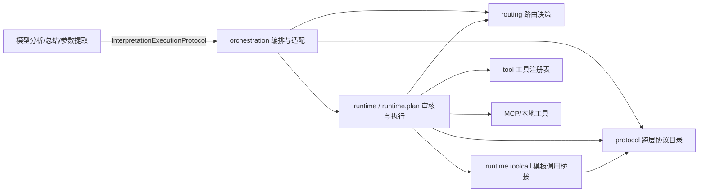
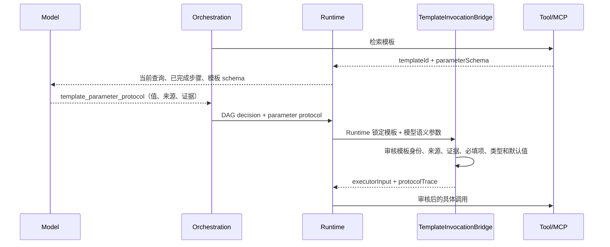

# ChatChat Agents 模块调用与协议规范

## 调用方向



依赖只能从上层指向下层或中立层：

1. `orchestration` 是应用编排层，可以调用 `runtime`、`routing`、`protocol` 和 `tool`。
2. `runtime` 是审核执行层，可以调用 `routing`、`protocol`、`tool`、`evidence`，不得反向引用 `orchestration`。
3. `routing` 是共享决策层，不得引用 `runtime` 或 `orchestration`。
4. `protocol` 是跨层协议入口，不依赖任何业务执行层。
5. `runtime.toolcall.TemplateInvocationBridge` 是所有模板参数进入执行器前的唯一审核和编译入口。
6. `evidence` 是领域证据层，不得引用 runtime 实现；需要 batch/plan 状态的诊断归一化代码属于
   `runtime.evidence`。

当前允许的顶层 package 依赖边为：

```text
assessment    -> evidence, protocol, runtime
evidence      -> protocol
orchestration -> assessment, evidence, protocol, routing, runtime, tool
runtime       -> evidence, protocol, routing, tool
```

未列出的新依赖必须先更新本规范并通过架构评审，不能通过临时 import 绕过。

## 模板调用链



模型只负责分析、总结和提取语义参数，不能决定最终模板身份、执行目标、默认值或类型转换。
Runtime 拥有模板绑定并负责最终审核；桥接层负责把语义参数编译为具体工具参数。

## 统一协议入口

跨 package 使用的协议版本统一声明在
`com.chatchat.agents.protocol.AgentProtocolCatalog`。

| 协议 | 所有者 | 调用方向 |
|---|---|---|
| `interpretation_execution_protocol_v1` | `runtime.plan` | model → orchestration → runtime |
| `template_parameter_protocol_v1` | `runtime.toolcall` | model → template bridge → runtime |
| `runtime_template_binding.v1` | `runtime.plan` | template discovery → runtime |
| `runtime_dependency_evidence.v1` | `runtime` | completed tools → executor adapter |
| `target_filters.v1` | `routing` | orchestration → discovery tool |
| `routing_trace.v1` | `routing` | orchestration/runtime → discovery tool |
| `runtime_argument_resolution.v1` | `runtime.plan` | runtime bindings → executor |
| `runtime_answer_candidate_v1` | `assessment` | runtime stages → assessment → finalizer |

领域对象内部使用、且不跨 package 读写的版本仍由领域类型自行维护。例如
`EvidenceExecutionContract.CONTRACT_VERSION`。

## 版本变更规则

1. 新协议必须先登记到 `AgentProtocolCatalog`，明确所有者、调用方向和用途。
2. 生产代码不得重复声明目录中已有的版本字符串。
3. 兼容旧版本时，在协议所有者入口完成转换；执行层内部只传递当前版本。
4. 删除旧版本前，必须移除转换器、兼容测试和观测指标，不能只修改 prompt。
5. 每次模板调用都生成 `protocolTrace`，记录目录版本、入口、执行协议、参数协议、模板绑定协议、
   templateId、executorTool 以及模型参数是否通过审核。

## 自动约束

`AgentModuleArchitectureTest` 持续检查：

- 顶层 package 调用图与本文件声明一致；
- `runtime` 不得导入 `orchestration`；
- `routing` 不得导入 `runtime` 或 `orchestration`；
- `evidence` 不得导入 runtime 实现；
- 跨层协议版本只能在 `AgentProtocolCatalog` 中声明。

协议或包关系调整如果破坏上述规则，测试会直接失败。
