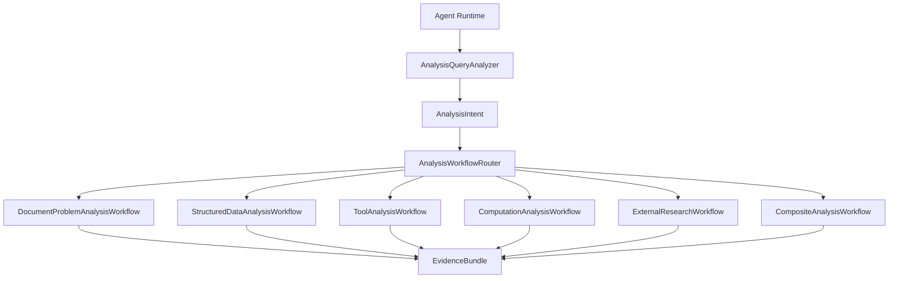
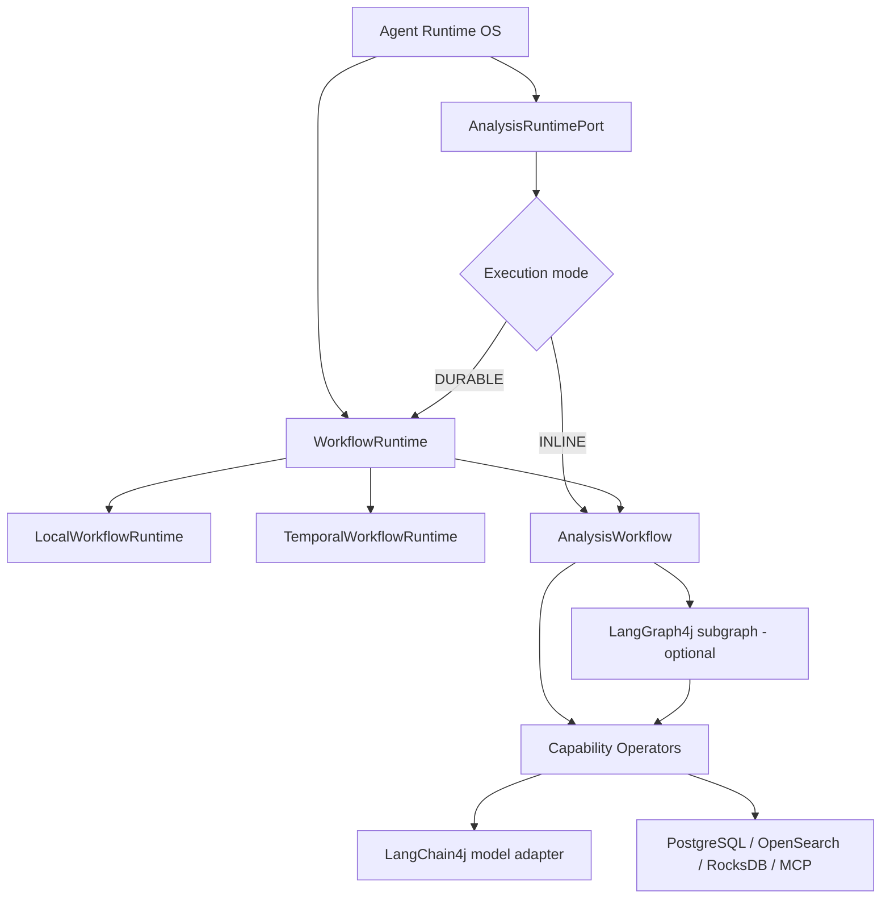

# Problem analysis workflows

`document_search` is an operator inside the document-class problem workflow. It
is not the Agent Runtime's top-level execution model.

The stable Runtime OS execution line is:

```text
Agent Runtime OS
  -> Query Analyzer
  -> AnalysisIntent
  -> Workflow Router
  -> AbstractAnalysisWorkflow
  -> Concrete Workflow
  -> WorkflowPlan
  -> Operators / Capabilities
  -> EvidenceBundle
  -> Verification / Synthesis
  -> AnalysisExecutionOutcome
```

## Common contract package layout

`chatchat-common` groups the framework-neutral analysis API by responsibility:

| Package | Responsibility |
| --- | --- |
| `analysis.model` | Intent, context, scope, capability, workflow type, and execution mode values |
| `analysis.plan` | Workflow plans, steps, and evidence requirements |
| `analysis.evidence` | Evidence bundle and typed evidence records |
| `analysis.execution` | Execution, verification, and final outcome records |
| `analysis.spi` | Extension ports implemented by analyzers, workflows, operators, and the Runtime |
| `analysis.routing` | Deterministic query analysis and workflow selection |
| `analysis.workflow` | The shared workflow lifecycle template |

Dependencies point from lifecycle and routing code toward stable contracts.
Domain modules implement the SPIs; infrastructure frameworks remain outside
`chatchat-common`. New contracts must be placed in the package matching their
role instead of accumulating in `analysis.workflow`.



## Execution engines

The Runtime OS owns two related contracts with different purposes:

- `RuntimeWorkflow<I, O>` defines the lifecycle of one executable workflow.
- `WorkflowRuntime` defines where a workflow execution runs and how it is started, observed, and cancelled.

Both contracts live in `chatchat-common` and have no LangChain4j, LangGraph4j,
Temporal, Spring, SQL, or storage dependency.



`INLINE` is the default. It runs short analysis inside the current Runtime
invocation or Temporal Activity. `DURABLE` must be requested explicitly through
`AnalysisContext.attributes.runtime.analysis.executionMode`; it submits `problem-analysis-v1`
through `WorkflowRuntime`. This prevents a short document lookup from creating
an unnecessary nested Temporal execution while still allowing long-running
analysis to gain durable retries, cancellation, and lifecycle visibility.

LangGraph4j remains invocation-local and may be used inside a concrete workflow
for branching or evidence-refinement loops. LangChain4j remains behind model or
capability adapters. Network, model, database, and search calls execute in an
Activity or local executor, never in deterministic Temporal Workflow code.

## Parent lifecycle

Every child extends `AbstractAnalysisWorkflow`, which fixes the lifecycle order:

```text
UNDERSTAND -> SCOPE -> PLAN -> EXECUTE -> VERIFY -> SYNTHESIZE -> RETURN
```

The parent class contains no OpenSearch, SQL, MCP, calculation, or web-search
logic. Infrastructure is reached through a child workflow or an
`AnalysisCapabilityOperator`.

The Runtime kernel owns context, routing, plans, execution, loop control,
governance, evidence, state, and observability. Workflows own the analysis
method, Skills own domain rules, and Operators own atomic infrastructure
capabilities. `AnalysisExecutionOutcome` is the stable result contract returned
to the Runtime.

`AnalysisWorkflowRouter` uses the capabilities declared by `AnalysisIntent`.
One capability selects its child workflow; multiple capabilities select
`CompositeAnalysisWorkflow`. Models may produce `AnalysisIntent`, while the
router remains deterministic. `StandardAnalysisQueryAnalyzer` supplies a
bounded rule-based baseline when no intent has been supplied.

## Workflow implementations

| Workflow | Required capability | Plan shape |
| --- | --- | --- |
| Document | `DOCUMENT_SEARCH` | PostgreSQL route, OpenSearch hybrid recall, RRF, BGE, parent section, RocksDB verification |
| Structured data | `STRUCTURED_DATA` | entity/metric resolution, dataset route, SQL plan/execute, quality check, aggregation |
| Tool | `TOOL_CALL` | capability route, permission, selection, binding, execution, response verification |
| Computation | `COMPUTATION` | input resolution, data check, algorithm selection, calculation, boundary/result verification |
| External research | `EXTERNAL_RESEARCH` | freshness, trusted sources, search/retrieval, deduplication, authority ranking, cross validation |
| Composite | multiple | child workflows, evidence merge, cross validation |

The non-document workflows use `AnalysisCapabilityOperator`. A database, MCP,
Python, Spark, or web-search adapter implements that port and declares the
capability it provides. If an operator is unavailable, the workflow returns an
explicit verification finding instead of fabricating evidence.

## Unified evidence

Every workflow returns `EvidenceBundle` containing typed `AnalysisEvidence`:

- `DocumentAnalysisEvidence`
- `StructuredDataEvidence`
- `ToolAnalysisEvidence`
- `ComputationEvidence`
- `ExternalResearchEvidence`

Composite workflows merge only child bundles and check that every required
capability contributed verified evidence. Skills remain domain rules and
knowledge; workflows define how evidence is obtained and analyzed.

## Runtime integration

`DefaultAnalysisWorkflowRuntime` implements the stable `AnalysisRuntimePort`.
It analyzes, routes, and executes with the existing `KernelDataScope`.
`DocumentKnowledgeSkillExecutor` now enters through this port when it is
available, so bound-document Skill execution follows the same parent lifecycle.
Its local document-workflow fallback exists for isolated module tests and
deployments that do not include the Agent Runtime module.

Add a new top-level workflow only for a new analysis mechanism. Domain-specific
behavior belongs in Skills, plans, or capability operators.

Complex search capabilities may contain their own execution workflow below the
selected problem-analysis workflow. `web_search` and
`enterprise_metadata_search` follow this pattern; see
[`search-execution-workflows.md`](search-execution-workflows.md).
