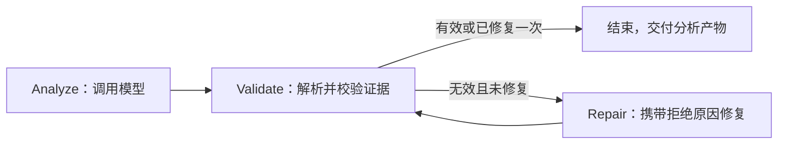

# 分析节点迁移

核心实现已退出 Driver / Worker / Reducer 角色包：

| 原实现 | 当前实现 |
| --- | --- |
| AnalysisDatasetWorker | DatasetAnalysisNode |
| AnalysisSummaryGovernanceBridge | nodes.analysis.AnalysisNodeProtocol |
| HierarchicalAnalysisReducer | nodes.merge.StructuredFindingMerger |
| AnalysisSynthesisCoordinator | nodes.synthesis.FinalSynthesisNode |
| AnalysisWorkerSupervisor / AnalysisReducerSupervisor | AnalysisProductValidator / MergedFindingValidator |

角色上下文 `rolePipeline` 已改为 `nodeInputs`。分析节点提示词不再要求扮演 Worker，综合上下文不再构造首席决策者、分析经理等角色。

`FindingAnalysisGraph` 是实际执行图：

验证由 Java 执行；修复最多一次，修复不可用时保留原产物，取消信号继续传播。状态产物支持 LangGraph4j 的序列化复制。该子图不自行创建持久化存储，持久恢复仍归 Runtime / Temporal 管理。

现有规划与工具执行图继续负责获取数据；Runtime 的语义计算先于分析节点执行；合并节点确定性地保留证据，不调用模型；最终综合由 `ReportPublicationGraph` 执行准入、综合与发布状态检查。

保留的 `WORKER` / `DRIVER` 等历史协议字段用于既有产物、事件和恢复数据，不代表创建角色 Agent。任务线程仍是执行资源，不是模型人格。

限制：此次迁移没有把所有数据集强制塞入一次模型调用，也不承诺整个请求固定三次推理。按问题规划计算、跨数据集补算和最终图文报告的真实质量仍需持续验证；仅修改包名不是这些能力的验收依据。
