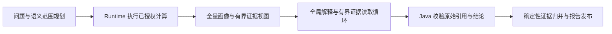
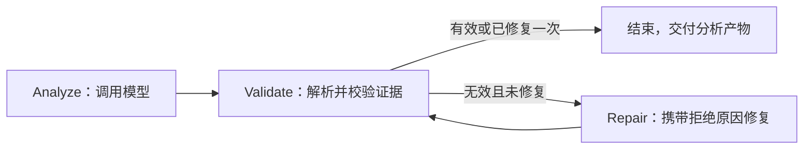

# 分析节点迁移

核心实现已退出 Driver / Worker / Reducer 角色包：

| 原实现 | 当前实现 |
| --- | --- |
| AnalysisDatasetWorker | DatasetAnalysisNode |
| AnalysisSummaryGovernanceBridge | nodes.analysis.AnalysisNodeProtocol |
| HierarchicalAnalysisReducer | nodes.merge.StructuredFindingMerger |
| AnalysisSynthesisCoordinator | nodes.synthesis.FinalSynthesisNode |
| AnalysisWorkerSupervisor / AnalysisReducerSupervisor | AnalysisProductValidator / MergedFindingValidator |

角色上下文 `rolePipeline` 已改为 `nodeInputs`。分析节点提示词不再要求扮演 Worker，综合上下文不再构造首席决策者、分析经理等角色。

外层主入口 `AnalysisCoverageCoordinator.analyze` 直接执行 `UnifiedQuestionAnalysisGraph`，不再创建或调用 `AnalysisDispatchCoordinator`。全部数据集作为一个问题的证据输入，保持各自记录边界。

`FindingAnalysisGraph` 保留在低层数据集分析接口中，已不在外层主链路调用：

验证由 Java 执行；修复最多一次，修复不可用时保留原产物，取消信号继续传播。状态产物支持 LangGraph4j 的序列化复制。该子图不自行创建持久化存储，持久恢复仍归 Runtime / Temporal 管理。

现有规划与工具执行图继续负责获取数据；Runtime 的语义计算先于分析节点执行；合并节点确定性地保留证据，不调用模型；最终综合由 `ReportPublicationGraph` 执行准入、综合与发布状态检查。

保留的 `WORKER` / `DRIVER` 等历史协议字段用于既有产物、事件和恢复数据，不代表创建角色 Agent。任务线程仍是执行资源，不是模型人格。

全局输出通过 `validateProduct` 进入原有证据校验和报告协议。这里逐数据集生成的校验产物仅用于证据谱系和覆盖对账，不会调用模型。最终报告综合仍是独立阶段；整个请求还包括工具规划等模型调用。

检查点按隔离域、完整输入和模型标识恢复；恢复后的 Findings 仍要重新校验证据。未知数据集引用和无效输出协议不进入成功路径。没有 Findings 的数据集记录在 `unifiedAnalysisDatasetsWithoutFindings`，图以 `COMPLETED_WITH_LIMITATIONS` 结束，记录覆盖不等于问题已回答。

大数据已接入分片全量画像、有界证据视图和最多三轮定向读取，不再要求所有记录进入一次调用。详见 [大数据证据执行](runtime-bounded-analysis-evidence.md)。当前范围规划仍使用问题与已解析的语义契约；任意公式补算、长文本逐片语义提取和最终图文报告完整发布联调仍未完成，不能据此声称整个 Runtime OS 已完成。
