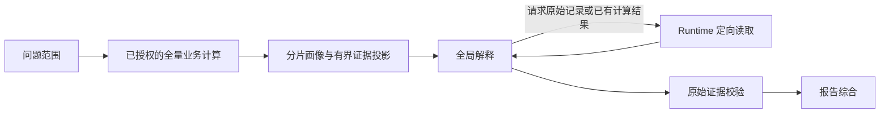

# 统一问题图的大数据证据执行

统一的是问题、计算依据和最终 Findings，不是模型调用次数。`UnifiedQuestionAnalysisGraph` 的主链路现在为：



## 数据与模型分离

- 全部原始记录留在 Runtime，用于计算、读取和最终校验。大数据不会按分片生成文字报告。
- 小数据在视图预算内可直接传递。超过预算时，对全量记录执行结构画像，每片 1000 行，每次运行最多 4 个并发分片。
- 字段画像归并非空数量、数值数量、精确十进制和、最小值、最大值及原始行号。和与数量分别归并，不平均分片均值。不把字符串标识猜成数值，不计算隐式业务指标。
- 模型收到画像、已有授权计算、有限的首尾及极值记录。选中记录携带原始 `recordRef`，不是重新从 1 编号，也不是代表性抽样。
- 画像最多跟踪 128 个字段；字段不完整时显式标记。结构统计只用于导航，不构成业务聚合授权。业务结论继续接受原有语义契约校验。

## 有界证据读取

原始视图预算 64000 字符，完整模型提示上限 160000 字符。超过视图预算的字段、列表明确显示省略标记，不用截短值冒充原值。保留原数据供读取。

模型可返回 `evidenceRequests`：

```json
{
  "operation": "READ_RECORDS",
  "datasetReference": "transactions",
  "fromRecord": 5001,
  "limit": 20,
  "fields": ["amount", "time"]
}
```

记录索引从 1 开始，每次最多 100 行；返回预算不足时包含 `nextRecord`，单个超大字段明确标记省略。`READ_CONTEXT` 按路径读取已有语义契约或计算结果，列表分页从 0 开始，每页最多 20 项。它不执行新公式或外部工具。

一次运行最多 3 轮解释，每轮最多 4 个证据请求。前两轮可以读取更多证据，最后一轮形成有限结论和未解决问题。所有读取结果继续受输入预算限制。未满足的问题不因预算耗尽被视为已回答。

## 恢复与覆盖

分片检查点由租户/运行隔离域、数据集、分片起点及内容哈希定位。成功分片可在失败重试时复用，失败的分片不生成成功检查点。

模型轮次检查点同时绑定完整源数据指纹、实际提示和模型标识。修改没有出现在模型视图中的记录，也会使对应源分片和 Findings 检查点失效。恢复的模型输出仍经过原始证据校验。

`unifiedEvidenceScanCoverage` 表示机器扫描范围；`unifiedAnalysisEvidenceRounds` 和 `unifiedAnalysisMaxPromptChars` 表示模型读取轮次和输入规模。投影模式固定附带限制并以 `COMPLETED_WITH_LIMITATIONS` 收尾：全量扫描不代表模型逐行语义审阅，更不代表所有业务问题已经解决。

## 验证与边界

自动测试覆盖五个数据集各 10000 行、全量统计、跨分片极值、原始中间行读取、不等长分片合并、失败恢复、未展示记录变化导致模型缓存失效，以及非法数据集/读取范围拒绝。

当前业务计算继续复用既有授权计算引擎；新增并发分片执行的是结构画像。补证循环现已支持新算术公式和长文本逐片候选提取，SQL 服务增加分页消费入口，具体接入范围见 [补充执行能力](runtime-supplementary-execution.md)。尚未将全部业务算子改为分布式算子，也未完成跨 MCP 的数据库页传输。字符预算不是模型专用 tokenizer 的精确 token 预算。这些边界必须与已完成能力区分，不能把五万行测试当作任意规模、任意模态报告质量的保证。
