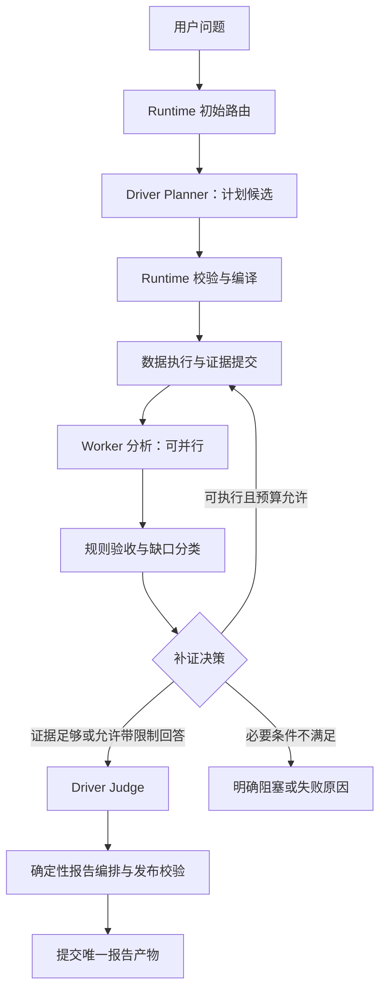

# Runtime OS 分析流程设计决策

日期：2026-09-05。状态：目标设计与渐进迁移约束，未表示全部实现。

后续实施更新：已按用户进一步要求引入 LangGraph4j core，接入 Worker 与最终综合子图，见
[LangGraph4j 接入范围与限制](langgraph4j-analysis-integration.md)。下文“未发现依赖”描述的是本设计制定时的基线，不再代表当前构建状态。

本文将用户提供的框架组合思路落到当前仓库，补充 [执行架构](runtime-os-workflow-execution-architecture.md)，不另建一套 Runtime。执行事实、权限、证据完整性等既有约束继续适用。

## 1. 核心目标与架构选择

Runtime OS 负责可靠、可解释、受预算约束地运行分析工作流；分析能力通过领域无关的 Contract 表达。交付单元是绑定数据、图表、解释与证据的 Analytical Insight Block。

采用附件中 Flow 与 Agent 分离、Evidence/Data 独立、Driver 统一协调的设计思想。显式状态图落实到已有 DAG 端口；当前检查的构建及运行时代码未发现 LangGraph 依赖，不将“已经使用 LangGraph”作为事实前提。本次不引入 CrewAI、LlamaIndex 或其他 Agent 框架依赖，也不依赖附件中关于这些项目维护状态的判断。

保留 Local / Temporal 执行适配。Temporal 管持久执行与恢复，分析域管计划含义与判断边界。同一副作用只能有一个执行归属和明确的重试负责人，不能由图引擎、Temporal、Worker、模型 SDK 各自独立叠加重试。

**Contract 是数据协议，事件是执行记录，两者均不自动产生模型调用。** 新增模型节点必须说明原有节点无法承担的认知任务、输入投影、调用预算及可验证收益。

## 2. 职责边界

| 层 | 负责 | 不负责 |
| --- | --- | --- |
| Runtime Flow | 路由、依赖、状态转移、并发、预算、补证是否可执行、发布唯一性 | 编造分析判断 |
| Driver Planner | 一次规划中表达目标、分析问题、方法、假设、证据需求和任务候选 | 判定工具已成功或授权已通过 |
| Data Executor / Evidence | 执行已准入操作、计算、提交结果、保存快照及谱系 | 通过自由文本改变执行事实 |
| Worker | 在分配范围内形成 Finding、解释与候选可视化意图 | 自行扩展权限、创建无限补证循环 |
| Rule Validation | 字段、单位、时间范围、引用、计算依据及覆盖检查 | 将程序校验包装成模型审核 |
| Driver Judge | 判断重要性、解释冲突、校准结论、确定故事线 | 重读全部原始数据再做一遍 Worker 分析 |
| Report Composer | 验证数字绑定、组合图数文、生成前端结构与文本降级 | 新增一次“润色后重写结论”的自由生成 |
| Local / Temporal adapter | 执行命令、持久恢复、取消和投递 | 第二套分析计划与语义状态机 |

Driver 是规划和判断的逻辑角色，不要求将 Planner 与最终 Judge 合成一次物理调用。计算与证据尚未返回时，Planner 不能预先生成最终判断。

## 3. 标准链路

缺口分类在最终判断前完成。数据准入 PASS 只表示可作为分析输入，不表示业务问题已完全回答；事件名称必须区分这两层含义。

Judge 若发现新的实质冲突，返回结构化缺口给 Runtime。只有预算内的显式修复转移才能重入；不能在 Answer、Reviewer、Fallback 中各自开循环。无法修复时标注限制或拒绝无依据的结论。

## 4. 快路径与深分析路径

初始路由只用可验证的请求约束与已知数据特征；数据取得后允许重新评估，并记录升级理由。不能仅按“ETF”关键词或数据集数量选择快路径。

快路径适用于数据语义和范围已明确、单分析输入无需归并、问题可由现有计算与证据支持且无实质冲突的情况。保持 Planner → 数据执行 → Worker → Judge → Composer；可直接复用已有合格计划。单切片和单输入归并走代码直通。

深分析路径用于授权的跨数据集关系、多切片归并、实质证据冲突或可执行补证。只增加被触发的阶段，并共享同一预算与最终发布入口。多切片覆盖不得为了“只有一个数据集”而被省略。

建议目标调用预算由计划计算：Planner 次数 + 实际 Worker 分片次数 + 必需归并次数 + Judge 次数 + 显式修复余量。3～6 次只可作为简单场景的验收目标，不能是所有任务的固定上限或已实现事实。

## 5. 数据与决策契约

以下为拟收敛的逻辑协议，优先扩展已有类型，不按每个名称新建 Agent。

| 协议 | 最小信息与约束 |
| --- | --- |
| AnalysisPlanBundle | 目标、问题树、假设、所需证据、任务、操作、依赖、预算建议；Runtime 校验后才可执行 |
| AnalysisExecutionPolicy | 路径、升级理由、调用/Token/迭代/时限预算；已消耗资源不能因切换路径归零 |
| DecisionContext | 目标、已验收 Finding、计算指标、证据引用、冲突、被拒绝主张、缺口；禁止默认拼入全部原始结果 |
| GapAssessment | 阻断性、影响的结论、可用获取动作、授权与预算结果、决定及理由；不能有缺字段就自动补证 |
| AnalysisCompletion | 业务分析结果状态、停止原因、执行状态引用、限制和最终产物引用；三者分开存储 |
| NodeExecutionMetric | 节点/父节点/依赖/尝试身份、排队和执行区间、模型/工具用量、失败、取消；未知指标显式为空 |

Evidence 存储完整结果与版本化计算输出。Driver 默认只拿决策投影；确需核对时，通过授权的 Evidence Resolver 拉取指定范围。对比数据必须声明粒度、时间、单位与关系，不能默认跨源可比。

每个重要结论至少有两种证据表达，其中一种为 Runtime 可验证的图、表或指标。缺数据的结论采用状态卡；数值完全来自已提交计算结果。图表类型由分析意图和数据适配规则决定。详见 [分析报告协议](analytical-report-runtime.md)。

## 6. 状态、重试与发布

业务分析结果拟统一为 `COMPLETED`、`COMPLETED_WITH_LIMITATIONS`、`NEEDS_MORE_EVIDENCE`、`BLOCKED`、`FAILED`、`EXHAUSTED`。其中 NEEDS_MORE_EVIDENCE 是待转移状态，必须指向可执行补证或明确阻塞；不能永久悬空。取消仍遵循执行生命周期，不映射为业务成功。

`ANALYZE_WITH_LIMITATIONS` 关闭补证，不等于已经发布成功。只有 Judge 产物和编排验证通过、报告提交完成，才能记录业务结果 COMPLETED_WITH_LIMITATIONS。预算耗尽原因可以与可用的部分报告同时存在，不能用其中一个覆盖另一个。

现阶段 `completed_with_limitations` 仅已用于最终综合阶段标签；公共 Run 状态尚未完成上述迁移。迁移必须更新序列化、持久化、恢复和前端兼容映射，禁止直接替换字符串后宣称状态机统一。

最终发布使用稳定的 run / analysis revision 身份进行幂等提交。恢复可以复用已提交 Worker、Judge 和报告产物；不能因为重放状态事件再次生成报告。Temporal Workflow 内保持确定性，模型/网络/数据库操作放在 Activity；更改命令顺序必须维护历史重放兼容。

## 7. 当前实现与迁移顺序

执行迁移更新：Planner 已通过 `GraphPlanningPort` 接入输入检查与计划产物检查；
取数、证据分析、补证和收尾已由 `InterpretationAnalysisGraph` 路由，宿主中的补证循环已移除。
Worker 与最终综合使用同一组显式终止状态；`FinalAnalysisGraph` 管理最终准入与发布。
包内 `InterpretationAnalysisSession` 保留请求状态并适配旧服务，公共 API 不变。
Local 和 Temporal 共用这些策略，持久恢复继续使用既有 continuation 与分片 checkpoint。
详细实际节点及兼容边界见 [LangGraph4j 接入](langgraph4j-analysis-integration.md)。

通用对话旧入口与旧 action JSON 兼容解析已移除；所有请求统一通过计划准入和图执行。
下表保留产品验收维度。已接通执行路径不代表已完成真实模型性能基准，
或已支持任意图节点的独立持久恢复。

| 顺序 | 已有基础 | 下一项交付 | 验收条件 |
| --- | --- | --- | --- |
| P0：可观测性 | MeteredChatModel、Worker 计时、Trace、工具记录 | 完整节点跨度、依赖和重试归属，覆盖 Local 与 Temporal | 能区分排队、执行、重试及并行；关键路径有依赖证据；不把事件数当调用数 |
| P1：确定性分析流 | AnalysisRefinementCoordinator、EvidenceAugmentationPolicy、自研 DAG | 从编排宿主收敛出统一路径与结束策略；补证决定先于最终判断 | 限制完成不落入耗尽分支；权限、必要步骤、取消及预算检查仍有效 |
| P2：收敛认知调用 | Planner、AnalysisDatasetWorker、HierarchicalAnalysisReducer | 用 trace 检验重复调用，合并计划输出与精简 DecisionContext | 单输入不新增模型归并；覆盖不丢失；调用数与最大上下文有对照数据 |
| P3：唯一报告出口 | AnalysisSynthesisCoordinator、ReportComposer、结构化前端 | 将所有成功及受限成功路径汇入同一发布契约 | 图数文相同依据；恢复不重复发布；降级不覆盖更完整的已验收报告 |
| P4：持久执行一致性 | WorkflowRuntime、Temporal 分析批次及 DAG 适配 | 同一分析策略覆盖本地与持久执行 | 相同输入产生相同转移决定；重启、超时、取消及重复投递有回归 |

已有单切片/单输入 Reducer 不调用模型；Hypothesis、Evidence Graph、模板反馈事件也不能直接算作独立模型阶段。迁移以实际调用链为依据，不为了缩短界面事件列表删除必要治理。

新增策略进入有明确职责的 collaborator；`AgentOrchestrationEngine` 继续缩减为组合入口，遵守 [职责审计与体积约束](chatchat-agents-runtime-os-responsibility-audit.md)，不在大类中追加另一套完整状态机。

## 8. 验收基线

固定样例覆盖单数据集单切片、多切片、授权多源比较、缺历史基期、无权限、空结果、部分工具失败、模型超时、取消和重启。对同一数据快照记录报告质量、证据覆盖、调用数、最大上下文、排队、关键路径和端到端 P50/P95。

快路径上线必须同时满足：结论和数字可验证、没有省略必要数据、无额外授权绕过、调用与耗时确有改善。既有证据回放回归失败应先核对修复，不能用选择性通过的测试作为整体迁移完成依据。

当前模型计量仍有供应商内部重试与完整 DAG 覆盖限制，见 [性能观测说明](runtime-performance-observability.md)。未完成真实运行对照前，不承诺将 26 分钟降低到某个固定时长。
