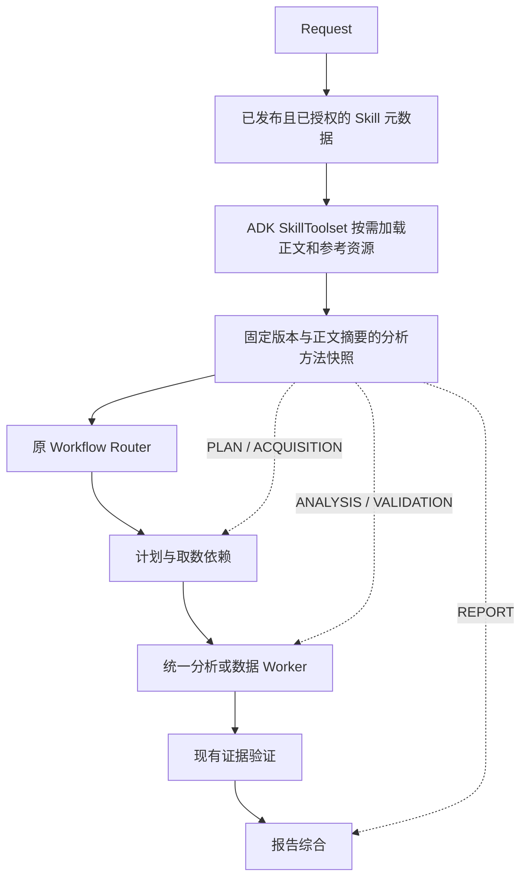

# Skill 分析上下文贯穿 Runtime

## 问题与职责

原主流程仅在 Agent 显式绑定领域 Skill 后读取正文，并另行调用 relevance router。编译结果只通过 `domainSkillPlanningContext` 进入计划生成。独立的 Google ADK Skill 执行入口没有自动成为 InterpretationPlan 的分析上下文；数据 Worker、统一分析快路径和最终综合之间也没有共同的 Skill 快照。因此“Skill 已发布/已选择”和“实际在报告中使用 Skill 方法”并不等价。

本次把 Skill 方法准备作为请求内同步子阶段，随后由原 Workflow Router 和 InterpretationPlan 继续执行。Skill 不创建第二个业务流程，不替换必需 MCP 工具，不把说明文本当作业务数据。

## 实现

- `SkillAnalysisContextService` 通过原 `SkillRouter` 发现候选。存在显式绑定时限制候选范围；没有绑定时允许已授权的相关 Skill 自动发现。自然语言索引未命中时，回退到最多 20 项已授权元数据供 ADK 判断相关性；仍走同一授权链。空目录和无相关 Skill 继续普通问答，不要求用户选择 MCP。
- 使用已有 Java ADK 依赖的 `LlmAgent`、`InMemoryRunner`、`SkillToolset`。首轮仅提供名称与说明；模型选择后调用 `load_skill`，必要时读取已声明的参考资源。没有脚本执行器、取数工具或任意文件系统访问。
- 对显式绑定，不能只看标题就返回“无相关 Skill”，必须先检查正文方法。相关性允许部分可复用的方法，但必须来自实际加载的正文；最终仍可判定无关。最近 6 条有界会话消息和摘要仅帮助解析追问意图，不作为当前事实或授权。Skill 示例值和时效性业务参数转换为核验要求，不视作已验证常量。
- `AdkAnalysisSkillSource` 读取时重新解析授权与版本；仅实际加载且最终再次通过校验的 Skill 能写入快照。未知别名、撤权、正文变化、超出加载预算均不能标记 APPLIED。
- 方法按 PLAN、ACQUISITION、ANALYSIS、VALIDATION、REPORT 编译，携带 Skill ID、版本和正文摘要。指纹以递归排序后的结构计算，跨 JSON 序列化顺序变化保持一致。
- `InteractionContext` 保存请求内快照；普通问答、角色问答、问题计划和资产指导都能使用。主分析 Runtime 把同一快照传给 DAG 计划、取数语义裁决、数据分析上下文、动态方法编译、统一分析及最终综合。
- 数据返回携带的同名上下文会被清除，只有 Runtime 传入的快照可以附着到 Worker。方法指纹是完整性检查，不是凭证或授权机制；权限仍来自数据库和 SkillResolver。
- 模型最多 8 次调用（初次 6 次、必要时格式修复 2 次）、96 个事件、6 个已加载 Skill；正文总计最多 72,000 字符，含参考资源总计最多 96,000，单资源最多 24,000 字节。一次格式修复复用原 ADK 会话中的已加载正文，不重写业务 DAG。父调用同步等待 ADK 子阶段结算；取消传播，不用局部等待超时提前结束父任务。
- 无相关 Skill、来源失败或协议错误分别记录 NO_RELEVANT_SKILL、UNAVAILABLE 等状态。基础流程继续，但不会声称 Skill 已应用。APPLIED 表示方法已加载和编译，不表示模型每项检查均已完成，也不代表答案质量已经得到人工确认。

现有业务取数、证据验证和发布判断保持由 Runtime 决定。资产类补充检索结束后仍禁止再次取数/改写计划。所有选择依据授权、元数据、模型相关性和通用阶段协议，不依据业务名称、模板 ID、客户号或问题关键词。

补充检索报告采用独立的采信投影：出现 NO_MATCH 时不把候选目录和旧草稿传入总结；其他情况下仅传入成功且语义采信的元数据，并明确其不是已执行的业务数据。Skill 中提及的数据源、方法和工具仅作为方法要求，不证明当前平台已配置对应能力。任务结果公开状态、Skill 版本和指纹，不公开完整编译提示正文。

## 官方依据与适配边界

[Google ADK Skills 文档](https://google.github.io/adk-docs/skills/)说明了按元数据、正文和参考资源渐进加载的机制，并仍将 Skills 标为 Experimental。这里复用仓库中已有 Java ADK 依赖，不因“原生 ADK”名称而假定所有 SDK 版本与功能一致，也不安装外部脚本。

独立 Skill Intelligence API 和已有的固定数据绑定/确定性算子仍保留。新的主流程集成使用 ADK 编译方法快照，不把每个 Skill 的独立执行结果拼接成最终报告，也不重复获取业务数据。

## 验证记录

2026-09-30 已完成 API 构建并部署至联调环境 `192.168.195.221`。本次没有升级 ADK 依赖、修改业务 Skill 内容、增加 MCP 授权或变更业务数据。

- 19 个相关测试类共 136 项定向回归通过，失败、错误、跳过均为 0；最后一次提示调整后重新执行受影响的 27 项并打包通过。覆盖实际 ADK 工具循环、显式/自动选择、无关 Skill、未知别名、撤权、版本/正文变化、加载预算、同会话格式修复、会话范围、父流程等待、取消传播、快照序列化、计划/分析/综合传递和补充检索采信。
- 这是定向回归，不是全仓库测试通过。历史全量测试中的既有失败见 `runtime-reliability-audit.md`；此次不将其重新归类为已修复。
- 部署文件：`/opt/chatchat-1.0.0-SNAPSHOT/lib/app/chatchat.jar`，SHA-256：`4602b7d8aef831f7ae2b75d980088ca3300c9fe0cb4e5478b4f49eee395ede98`。启动 PID 为 `1441495`。
- 上一部署版本备份：`/opt/chatchat-deploy-backup/skills-20260930-0940`；本功能部署前的原始版本保存在 `skills-20260930-0900`。MCP 服务未替换。

| 最终部署用例 | Task ID | 结果与检查 |
| --- | --- | --- |
| 未绑定 Skill，自动发现核查方法 | `03ebfcb4-37d8-3fc8-8bf1-a65b81c6c98f` | SUCCESS；实际加载 2 项 Skill，APPLIED；0 次 MCP；报告区分方法与实际数据，将税率等参数列为待核验项 |
| 普通直接问答 | `81860a0b-d5df-3e68-956e-60ea1c198584` | SUCCESS；NO_RELEVANT_SKILL；0 次 MCP；按要求两句话回答 |
| 资产说明、补充检索未匹配 | `46b41080-d993-3ad1-8d2c-476c8f662bdb` | SUCCESS；2 次 MCP 发现调用、0 次改写；Runtime 先于父任务结束；没有把未匹配候选写成平台已有能力。本轮 Skill 判定无关，不声称已应用 |
| 真实数据分析 | `8327223b-678d-3c83-aba5-c44b8d1d4bf9` | PARTIAL_SUCCESS；3 次 MCP 成功、22 条记录、2 个数据集；2 项 Skill 为 APPLIED，请求、两个数据集分析上下文、归并结果及最终综合的指纹全部一致；Runtime COMPLETED 先于父任务结算 |

真实数据用例的结论覆盖审计为 FAIL，因此不计为完整业务验收通过；Runtime 元数据的 `publicStatus=SUCCESS` 与父任务 `PARTIAL_SUCCESS` 还存在既有投影差异。本轮证明了 Skill 方法传递和子流程结算，未证明所有最终结论都满足证据覆盖要求。部署后健康检查 UP，Web HTTP 200。

前一部署迭代的资产用例 `7ec45ad8-ce00-3792-b9f4-b3c2fe520ac4` 已验证 APPLIED、2 项 Skill、计划与 Runtime 结果指纹一致，同时保持 2 次 MCP、0 次改写。模型相关性选择存在波动，不能把一次选择结果解释为所有问题都能稳定选中同一 Skill。

前一迭代的完整专业分析用例 `4f99fb87-dc72-39bb-9641-28d45e9af015` 在最后一组数据等待外部模型较长时间；为替换已修正版本，联调人员显式取消，确认任务和 Runtime 均为 CANCELLED 后才重启。它是取消传播记录，不算正常完成的成功用例。另一个诊断任务 `4caab934-c310-39f8-969f-ea4b28eefd5a` 同样按取消记录保留。

临时直接问答 Agent `codex-skill-context-direct-20260930` 已在其用例结束后删除；任务审计记录保留。本次未创建需要清理的临时 MCP 授权。
